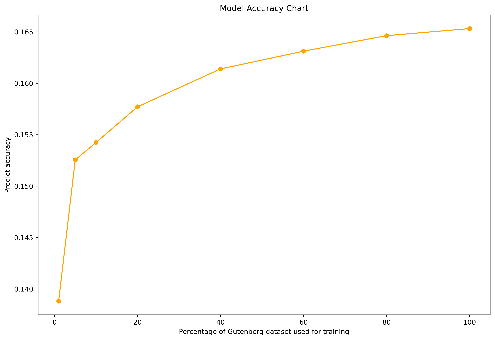

# First-Two-Character-Input Method for Sentence Generation

Welcome to the First-Two-Char Input Method for Sentence Generation project! This project aims to generate complete sentences based on the first two characters provided as input. I utilize the KyTea toolkit for word segmentation and sentence generation. The approach includes training a statistical model on a preprocessed corpus and evaluating its performance based on accuracy.
 

**The standard input: fitwchinme**
   
**The expected output: first two character input method**

## Usage

To run the project, follow these steps:

1. **Clone the Repository**:
   ```sh
   git clone https://github.com/AlgernonLiu/first-two-character-input.git
   cd first-two-char-input-method

2. **Install Dependencies**:
   ```sh
   pip install nltk kytea

3. **Generate Train and Test Set**:
   In my project, I use Gutenberg dataset as training data and Brown dataset as testing data. For training data, I use different proportion of Gutenberg dataset for data preprocessing, so you will see many train text files(you can also change it by change the proportion variable); while for test data, I use 100% Brown dataset and generate the text file with only first-two-character(input) and with whole sentence(ground truth). The data_generation.py not only download these dataset, but also do the preprocessing: delete the illegal characters such as (, /.
   ```sh
   python3 data_generation.py

4. **Make corpus**:
   It will exclude the first two characters from each word, for example:
   ```sh
   input: This is the sample sentence
   output: Th/This is/is th/the sa/sample se/sentence   
   
   Since we have different percentage of Gutenberg dataset input, so you may need to make corpus for each text file, or you can just make corpus for 100% Gutenberg dataset
   And the corpus will be added below the text. So supposed the original text have 50 lines, then it will have 100 lines after corpus generation!(raw text + corpus text)
   ```sh
   python3 make_corpus.py <data>.txt

5. **Train model**:
   The default model name is model.dat, you can change the name if you have different models to train.
   ```sh
   train-kytea -full corpus/<data>.txt -model model.dat

6. **Model Evaluation**:
   Accuracy evaluation method is executed on the test set. First is the accuracy of the generated sentence compared with ground-truth sentence. But since the ambiguity of the prefix, so we can have many result from the same prefix sequence, for example:
   
   **input: fitwchinme**
   
   **ground truth: first two character input method**
   
   **another possible output: final twitch channel in media**
   
   So even using all datasets to train, the accuracy for the test set is still below 20%.
   ```sh
   python3 test.py -model <model>.dat
   ## or you can run this code to evaluate all the model that exist:
   python3 test_all.py
   
   ## output example for python3 test.py -model model.dat------------------------------

   Average Accuracy: 0.1653117690542115
   Best Accuracy: 0.625
   Best Example:
   Prediction: You do seemed to know much about UNK
   Ground Truth: You dont seem to know much about reality
   Correct Words: ['You', 'to', 'know', 'much', 'about']
   Incorrect Words: [{'predicted': 'do', 'actual': 'dont'}, {'predicted': 'seemed', 'actual': 'seem'}, {'predicted': 'UNK', 'actual': 'reality'}]

**Here is the figure for different proportions of the Gutenberg dataset used for training:**

## Introduction
In this project, I propose a novel approach for sentence generation using a first-two-char input method. The method predicts complete sentences based on the first two characters of each word. This approach is particularly useful for applications where typing speed and efficiency are critical.

## Method
1. **Data Collection and Preprocessing**: I use text data from the Gutenberg and Brown corpora. The Gutenberg corpus includes works of classic literature, providing a rich and diverse language dataset. The Brown corpus consists of various genres of written American English from the 1960s, offering a broad spectrum of contemporary language use. The data is preprocessed to remove non-alphanumeric characters.
2. **Corpus Creation**: Using the KyTea toolkit, I segment the text into words and generate sentences based on the first two characters of each word.
3. **Model Training**: Train the statistical model on the generated corpus to predict complete sentences given the first two characters.
4. **Evaluation**: The model's performance is evaluated using accuracy.

## Dataset
Training Dataset: The dataset is collected from the Gutenberg corpus, which includes a variety of literary works.
Testing Dataset: The dataset is collected from the Brown corpus, representing a wide range of written American English.
Preprocessing: I remove illegal characters from the text data before using KyTea for segmentation.

## Acknowledgments
This project references code for training with KyTea from the repository [a-first-two-char-input-method](https://github.com/yaitaimo/a-first-two-char-input-method). I extend my sincere thanks to the original author for their contribution.
